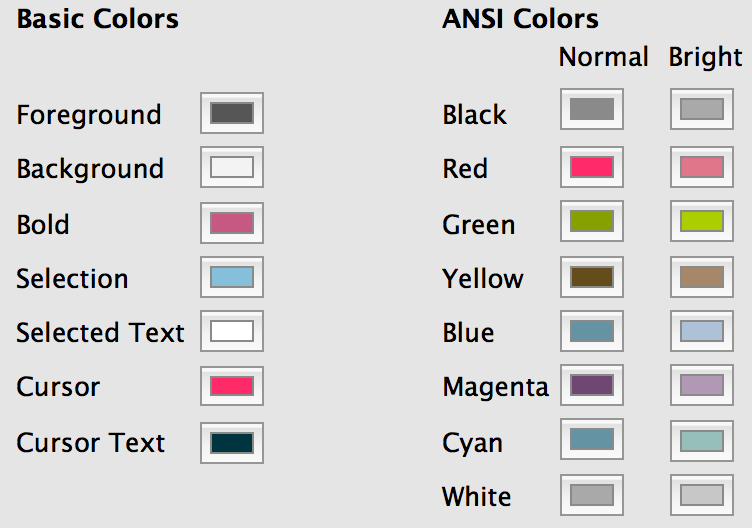
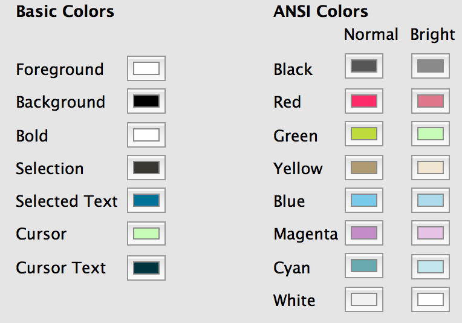

# Description #
Custom color scheme for iTerm2, it comes in two flavors:

- light
- dark

Original work can be found here: http://noahfrederick.com/vim-color-scheme-hemisu/

# Screenshots #

## Light version ##

## Dark version ##

